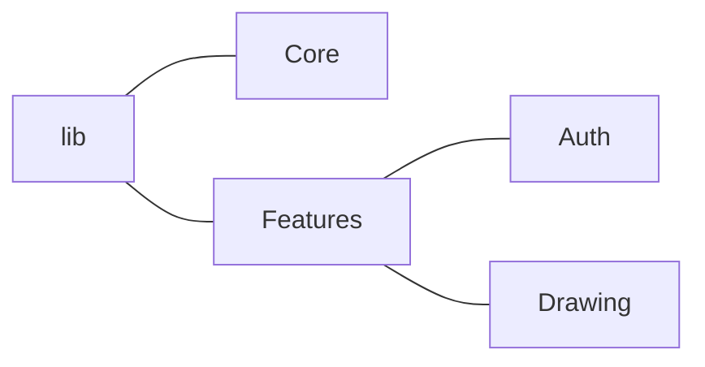
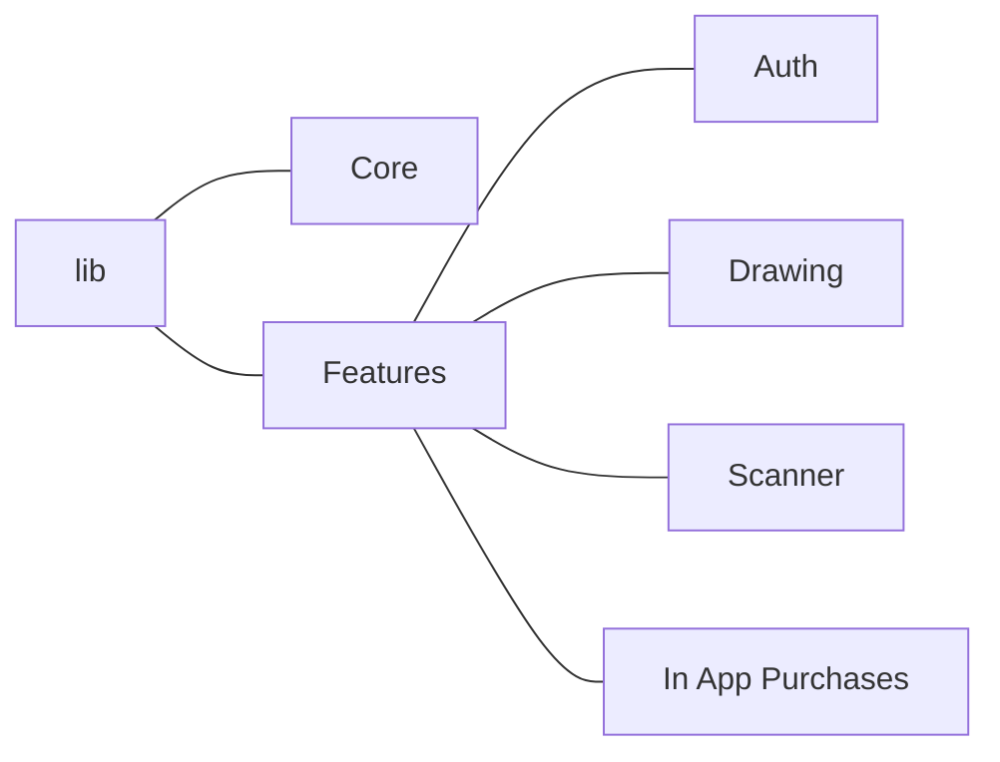
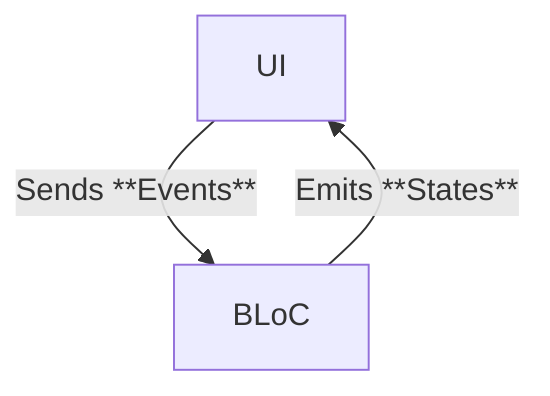

# Architecture Overview

By Xiuxuan Wang @ Team CopyPaste

## Part I. Overview

The SketchPaste App is supposed to be architected using the [Clean Architecture](https://blog.cleancoder.com/uncle-bob/2012/08/13/the-clean-architecture.html). The benefit of this approach is that it enables the separation of concerns and ensures the testability and expandability of the app. In this article, we will be briefly taking a look at how the clean architecture is implemented in the codebase for the drawing features. 

(Image from <a href="https://blog.cleancoder.com/uncle-bob/2012/08/13/the-clean-architecture.html">the Clean Code Blog</a> by Robert C. Martin)

## Part II. Application Structure

By using the clean architecture by uncle bob, we separate the application into different features. Currently, there are two main features of the app: authentication & drawing. Hence, the application is structured like this:

Later, when we plan to add in-app purchases, camera scanner, and more, the clean architecture should allow us to expand easily.

 ## Part III. 3 Layers of a Feature

### 1. Domain Layer

In the clean architecture, the domain layer is the layer where the logic lies. It should define the core data structure of the app and the interfaces between the front-end and back-end. For the drawing feature, we have two sub-folders under the domain layer: 

#### 1) Entities

Entities are the data structures that we need to present in the presentation layer. For drawing, we have the following entities:

- `SPDrawing`, which represents a drawing. It contains the name of the drawing, the creation date of the drawing, the updated date of the drawing, and the UUID string of the drawing. 

- `SPStroke`, which represents the data structure of a stroke, which contains a list of `SPPoint`s and many other metadata, i.e. the color of the stroke, the pen settings when drawing the stroke, etc. 
- `SPPoint`, which repsents a point in the center-line of the stroke. Note that the points on the border of the stroke are calculated using the `perfect_freehand` package and the corresponding pressure of each `SPPoint`. `SPPoint` contains the `x` and `y` coordinate of a point on the canvas, and also the pressure that the stylus exerts on the canvas when drawing the point. 

Note that the models are prefixed by SP, which stands for Sketch Paste (our app name), to avoid naming collisions with default flutter names. 

The details of SPPoint, the caching policy, and more optimizations will be discussed in a separate document. 

#### 2) Repositories

Repositories in the domain layer define the interface between the data layer and the presentation layer. In the drawing feature, we need to save the data to and from the database. Note that since we are following the clean architecture, we do not need to care what database we are using. The domain layer should be independent of both the presentation layer and the data layer. Hence, we define abstract classes in this layer. 

We defined two repositories. One repository is responsible for defining the interface for database actions related to the drawing data (i.e. strokes), while the other is responsible for defining the interface for local persistence of user data, i.e. saving the current tool that the user is using. The former is called the `ISPDrawingRepository`, with I representing this being an `interface` and `SP` representing the Sketch Paste name. The latter is called `ISPDrawingToolbarRepository`. 

Below we show some sample interface defined in the `ISPDrawingRepository`, which defines the interactions with the database. Currently we are not utilizing any realtime features, but we plan on implementing a direct link to the realtime database via `Stream` in Flutter. 

| Methods                                                 | Explanation                                                  |
| ------------------------------------------------------- | ------------------------------------------------------------ |
| `createNewDrawing()`                                    | asks the backend to create a new `SPDrawing` in the database, and return that instance. |
| `loadStrokes(SPDrawing drawing)`                        | loads the `SPStroke`s of the drawing and returns as a list.  |
| `setStrokes(SPDrawing drawing, List<SPStroke> strokes)` | sets the `SPStroke`s to the database for the drawing`        |
| ...                                                     | ...                                                          |

These repositories, as stated above, are interfaces. However, due to the fact that Dart does not have an interface type, we define them as abstract classes. The concrete implementations of these classes will be on the data layer. With this level of abstraction, we can easily swap out data sources in case we want to without having to modify the code in the domain layer and the presentation layer. 

### 2. The Presentation Layer

The presentation layer reads information from the domain layer, and displays them in the UI. We are using the `flutter_bloc` library for presentation, which wraps the `Stream` and `StreamBuilder` under the hood, while at the same time reducing the boilerplate code that we need to write. 

We use the BLoC pattern for state management. BLoC stands for Business Logic Component, and it allows us to separate the UI logic from the UI components, as the UI component can be very nested with Flutter's widget tree. There are three key components in the BLoC pattern: state, event, and bloc. 

#### 1) State

The state should be the underlying data structure that represents how the UI should look like. For example, if you have a toggle switch, then the state could be a bool that represents whether if the toggle is on or off. In our app, there are many states to keep track of. For the drawing state, we keep track of the current `SPStroke` that is being drawn, and the `SPStroke`s that have already been drawn. For the current tool state, we wrapped the state outside a `SelectableItem` variable, which is from the package `selectable_item` that Xiuxuan created. The ui shall be bound to the state using the widget `BlocBuilder`. 

#### 2) Event

Events are classes that represent what happens in the user interface. For example, if the user presses a button, then a button pressed event will can be sent to the bloc. In our case, when the stylus touches the canvas, the `Listener` widget will send a `pointerDown` event, when the stylus moves on the canvas, the `Listener` widget will send a `pointerMove` event, and when the stylus stops on the canvas, the widget will send a `pointerUp` event. 

#### 3) BLoC

The bloc is responsible for handling the events and map them to states. The UI would update accordingly. In our example, when the bloc receives a `pointerDown` event, the BLoC would initialize a `SPStroke` and set it to the state's `currentStroke`. When the BLoC receives a `pointerMove` event, the BLoC would update the `currentStroke` to add the current position of the stylus. When the BLoC receives a `pointerUp` event, the BLoC would set the `currentStroke` to null and add the stroke to the list of `SPStroke`s. 

### 3. Data Layer

In the data layer we implement the read & write functions defined in the domain layer. Specifically, we create implementations for the repository interfaces. For example, we have `SPDrawingRepositoryImpl`, which is the implementation of the `SPDrawingRepository`. We implement read and write functions from the firebase database. 

